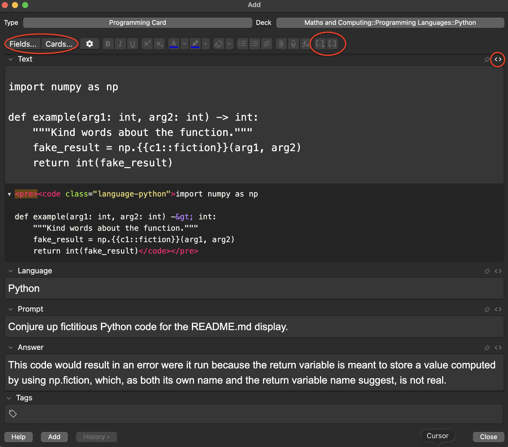
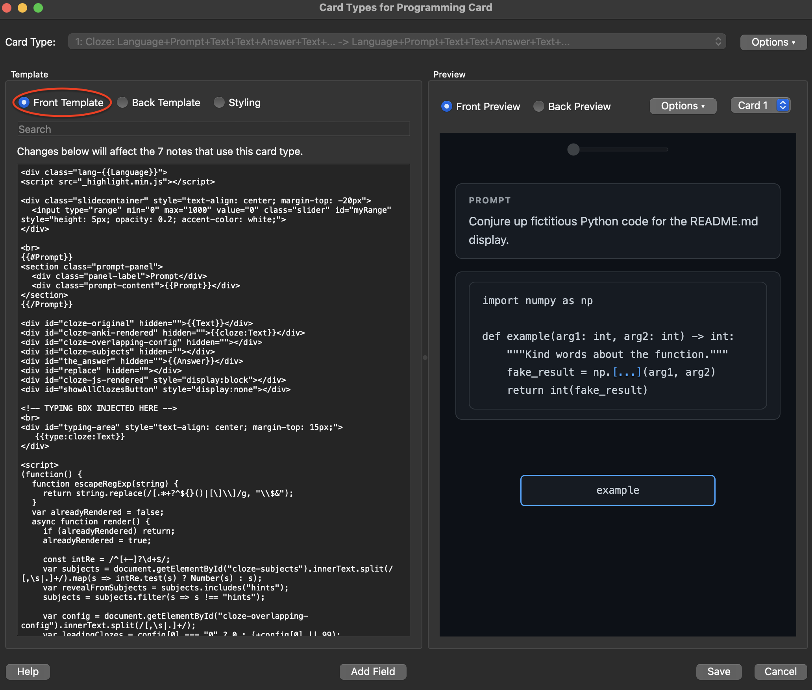
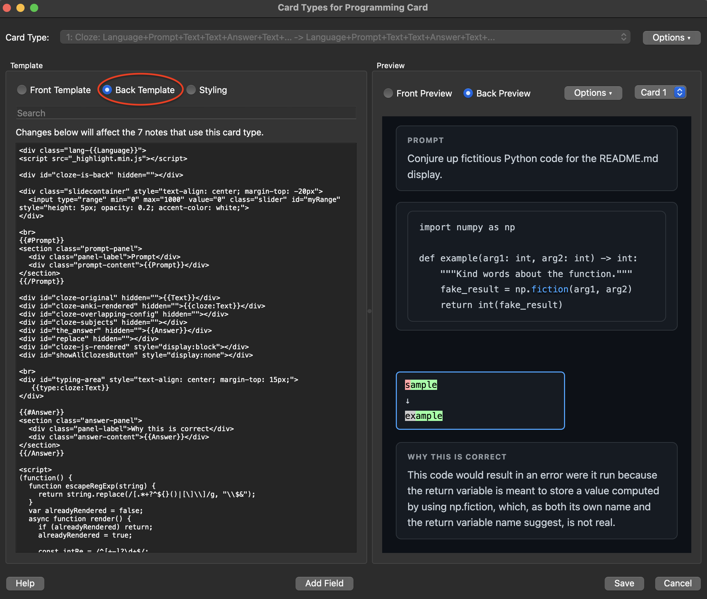
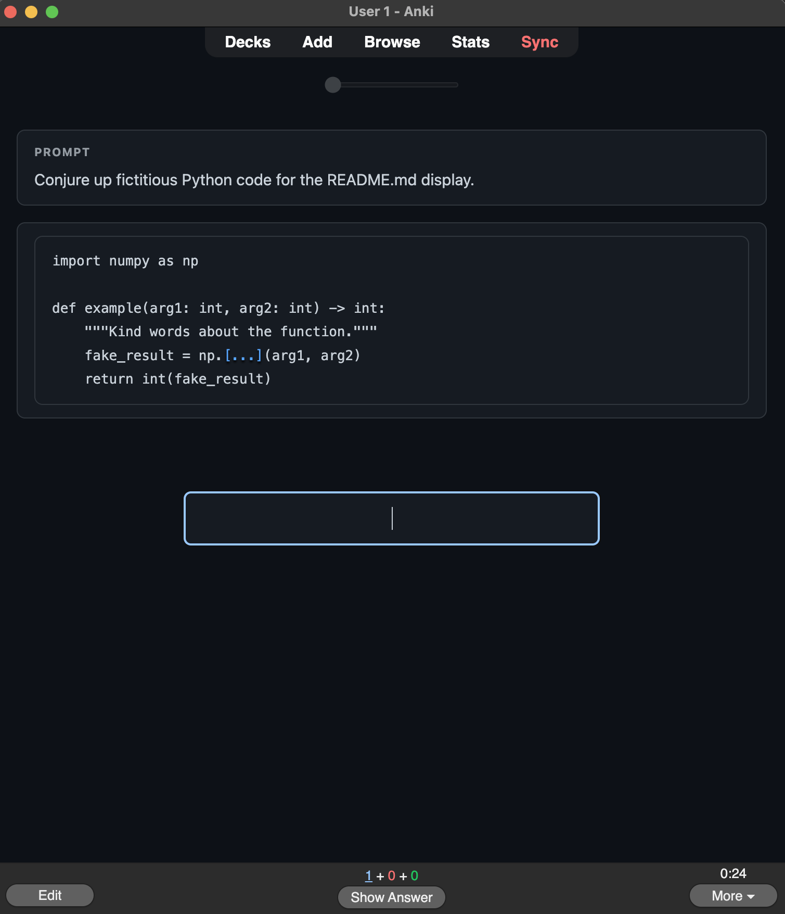
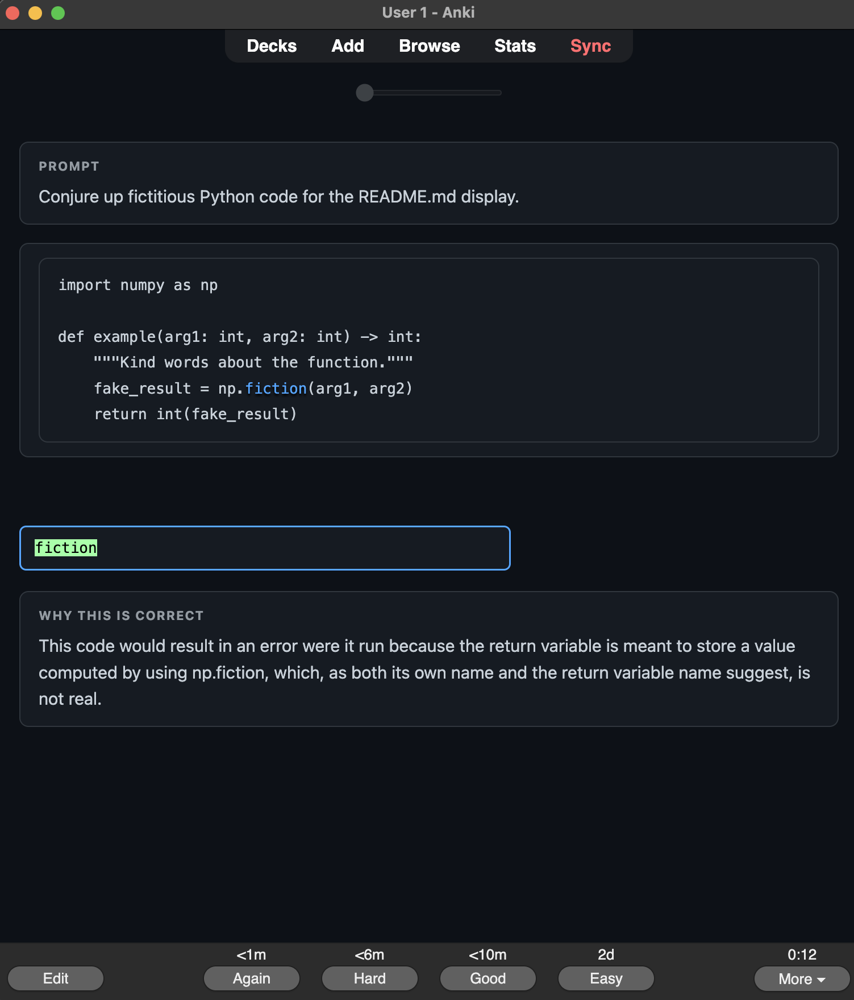

# Anki Programming Card: Cloze Overlapping with Syntax Highlighting

This repository contains the templates, styling, and setup notes needed to build an Anki note type for programming study: Cloze Overlapping cards, type-in answers, and offline syntax highlighting.

It was built for the sort of learning that happens best through the hand: writing the thing down, or in this case, typing it until the spell holds. Anki supplies the long memory; Cloze Overlapping supplies the questions; the code block keeps its colours, so the page does not look as grim as a raven in a coal shed.

The result is a small, copy-and-pasteable setup for learning programming and query languages one token at a time.

---

## What This Does

- **Cloze Overlapping cards for programming**: each `{{c1::token}}` is tested one at a time, in sequence, while surrounding context remains visible.
- **Type-in answers**: you type the missing token instead of merely turning the card over.
- **Offline syntax highlighting**: a local `_highlight.min.js` file powers `highlight.js`; no syntax-highlighting add-on is required.
- **Seven language themes**, each with its own banner and accent colour:
  - `Python`: GitHub Dark, with deep navy and blue keywords.
  - `Cpp`: Catppuccin Mocha / Cursor, with dark purple and cyan accents.
  - `SQL`: Dark Navy + Amber, with midnight blue and gold keywords.
  - `Java`: JetBrains Darcula, with charcoal and gold identifiers.
  - `CSharp`: Visual Studio Dark, with charcoal and teal accents.
  - `Rust`: Oxide Dark, with warm dark brown and rust accents.
  - `Go`: Gopher Blue, with deep blue and cyan accents.

---

## Repository Structure

```text
anki-programming-card/
├── .gitignore
├── LICENSE
├── README.md
├── example-screenshots/
│   ├── ex-01-add-html-and-fields.png
│   ├── ex-02-front-preview.png
│   ├── ex-03-back-preview.png
│   ├── ex-04-full-card_front.png
│   └── ex-05-full-card_back.png
├── styling/
│   └── card-styling.css             # Paste into the Anki Styling tab
└── templates/
    ├── back-template.html           # Paste into the Anki Back Template editor
    └── front-template.html          # Paste into the Anki Front Template editor
```

---

## Requirements

- **Anki**, preferably a recent desktop version. This setup has been tested on macOS.
- **Cloze Overlapping** note type, available from AnkiWeb.
- **`_highlight.min.js`** in your Anki media folder, as described below.

No add-ons are required beyond the base Cloze Overlapping note type. The old Syntax Highlighting for Code add-on is not used here; it appears to be abandoned and does not play well with recent Anki versions. Rather than bend the knee to obsolete software, this setup goes around it.

---

## Setup

### 1. Clone or Download This Repository

```bash
git clone https://github.com/DeenAthani/anki-programming-card.git
```

Cloning is convenient, but not strictly required. You can also copy the templates and styling directly from GitHub into Anki.

### 2. Download highlight.js

Download the minified library from the CDN:

```text
https://cdnjs.cloudflare.com/ajax/libs/highlight.js/11.9.0/highlight.min.js
```

Save it as **`_highlight.min.js`**. The leading underscore matters: Anki treats underscore-prefixed media files more cautiously during its periodic sweep for unused files.

Move `_highlight.min.js` to your Anki media folder:

```text
~/Library/Application Support/Anki2/[YourProfileName]/collection.media/
```

On macOS, you can open the Anki folder from Terminal:

```bash
open ~/Library/Application\ Support/Anki2/
```

You can also open Anki and choose **File -> Switch Profile** to confirm your profile name.

### 3. Clone the Cloze Overlapping Note Type

1. Open Anki and choose **Tools -> Manage Note Types**.
2. Select your existing **Cloze Overlapping** note type.
3. Click **Clone** and name the clone `Programming Card`.
4. Select `Programming Card`, then click **Fields**.
5. Keep the `Text` field as the first field.
6. Delete the inherited fields you do not need, including `Replace`, `Attached`, `Overlapping`, `Subject Clozes`, `Deck ID`, `Summary 1` through `Summary 10`, and `Back Extra`.
7. Add exactly these fields, in this order:
   - `Language`
   - `Prompt`
   - `Answer`
8. Click **Save**.

Do **not** start from **Add: Basic (type in the answer)**. The Cloze Overlapping note type carries bespoke JavaScript that must be preserved; cloning is the proper path.

This programming variant hardcodes the unused Cloze Overlapping configuration values inside the templates, so Anki needs only four fields:

- `Text`
- `Language`
- `Prompt`
- `Answer`

### 4. Paste the Templates and Styling

1. Select `Programming Card`, then click **Cards**.
2. Select **Front Template** and replace its contents with `templates/front-template.html`.
3. Select **Back Template** and replace its contents with `templates/back-template.html`.
4. Select **Styling** and append the contents of `styling/card-styling.css` below your existing rules.
5. Click **Save**.

Append the styling rather than replacing everything. The base Cloze Overlapping styles must remain, or the machinery beneath the throne may stop turning.

### 5. Create Your First Card

1. Click **Add** and set **Type** to `Programming Card`.
2. In the **Text** field, click the `<>` HTML source button in the top-right corner.
3. Paste your code block with cloze markers:

```html
<pre><code class="language-example">
[your code goes here; replace "language-example" with the desired language class]
</code></pre>
```

You must include the `<pre><code>` wrapper at the start and the `</code></pre>` wrapper at the end. Without them, the code will not be highlighted correctly.

4. Click `<>` again to return to visual mode.
5. In the **Language** field, type one of `Python`, `Cpp`, `SQL`, `Java`, `CSharp`, `Rust`, or `Go`.
6. Add an optional **Prompt** with the question or context you want visible before the code.
7. Add an optional **Answer** explaining why the missing token is correct; this appears on the back only.
8. Make cloze deletions and styling adjustments in the `Text` field as needed.
9. Click **Add**.

For C++ and C#, use `Cpp` and `CSharp` in the **Language** field, not `C++` or `C#`. CSS class names are easier to rule when punctuation is not invited to court. For highlight.js, use `language-cpp` and `language-csharp` inside the `<code>` tag.

---

## Example Screenshots

The `example-screenshots/` folder shows the setup in Anki from note entry through finished card review. Use these as visual companions to the setup steps above.

### Add HTML and Fields



### Front Preview



### Back Preview



### Full Card Front



### Full Card Back



---

## Language Class Reference

| Language field value | Theme | Accent colour |
|---|---|---|
| `Python` | GitHub Dark | `#58a6ff` blue |
| `Cpp` | Catppuccin Mocha | `#89dceb` cyan |
| `SQL` | Dark Navy + Amber | `#f5a623` amber |
| `Java` | JetBrains Darcula | `#ffc66d` gold |
| `CSharp` | Visual Studio Dark | `#4ec9b0` teal |
| `Rust` | Oxide Dark | `#dea584` rust |
| `Go` | Gopher Blue | `#00add8` cyan |

Use the matching highlight.js class in the `Text` field:

```html
<pre><code class="language-csharp">
{{c1::public}} class Example
{
    {{c2::static}} void Main() {}
}
</code></pre>
```

Common values:

- `language-python`
- `language-cpp`
- `language-sql`
- `language-java`
- `language-csharp`
- `language-rust`
- `language-go`

---

## How Cloze Tokens Work

Wrap any term you want to test in cloze syntax:

```html
{{c1::token}}
```

You can also highlight a token in Anki and click the `[...]+` button near the $f_x$ button to wrap it automatically. Number the clozes sequentially. The Cloze Overlapping engine creates one sub-card per cloze number, testing each token individually while leaving the surrounding code visible.

For multi-word tokens, wrap the whole phrase:

```html
{{c1::FULL JOIN}}
```

To show a blank with space for multiple recalled terms, use a hint-style cloze:

```html
{{c1::FULL JOIN::  __  __  }}
```

For a token inside a larger expression, wrap only the meaningful part:

```html
ON table1.{{c3::column_name}} = table2.column_name
```

The type-in box asks you to reproduce the hidden token exactly. Keep answers short, precise, unambiguous, and consistent with how you would write them in code.

---

## How highlight.js Integrates

The key architectural decision is when highlighting runs relative to the Cloze Overlapping render cycle.

`highlight.js` must **not** run on the raw `{{Text}}` field before cloze processing. If it does, it wraps tokens in `<span>` tags and breaks the regular expression Cloze Overlapping uses to find and blank out `{{c#::...}}` patterns.

This setup loads `highlight.js` at the top of each template so the file is parsed while the rest of the page loads. The actual `hljs.highlightElement()` call happens inside the Cloze Overlapping render function, immediately after `divJsRendered.innerHTML = question`. By then, all cloze blanking is complete and the final HTML has been written to the visible div.

A `try/catch` block with a 300 ms retry handles the edge case where `hljs` has not finished loading on the first card of a session.

---

## Known Behaviour

- **C++ and C# field values**: type `Cpp` and `CSharp`, never `C++` or `C#`, in the **Language** field.
- **HTML mode is required**: use the `<>` HTML source button when entering code into the `Text` field. Typing `<pre><code>` into the visual editor renders it as literal text.
- **Prompt and Answer fields**: `Prompt` appears on the front and back. `Answer` appears on the back only. If either field is blank, its panel is hidden.

---

## Recommended Anki Settings

For serious study, these add-ons are worth considering:

- **FSRS4Anki** (add-on ID: `759844606`): a modern spaced-repetition algorithm that is meaningfully more efficient than the default SM-2 scheduler for technical material.
- **Review Heatmap** (add-on ID: `1771074083`): useful for tracking consistency, which matters more than the length of any single study session.

---
## Prior Art & Acknowledgements

This project is not the first attempt to make Anki friendlier for programming study, typed answers, or syntax-highlighted code. It stands on the shoulders of earlier experiments, add-ons, templates, and long-suffering Anki users who looked at plain flashcards and decided the old ways were not enough.

- [ValentinSchwind/Multi-Line-Typing-Anki-Template](https://github.com/ValentinSchwind/Multi-Line-Typing-Anki-Template) provides an Anki template for multi-line typed answers, answer comparison, and syntax highlighting. It is a useful neighbouring project for anyone who wants richer typed-code review behaviour.
- The `diff_match_patch` work by Neil Fraser and contributors is acknowledged by that project for typed-answer comparison.
- `prism.js` and `highlight.js` are both part of the broader ecosystem that made syntax-highlighted Anki cards practical.
- Arthur Milchior’s writing on using `highlight.js` in Anki templates helped establish the path for this.
- The wider Anki add-on and template community, including projects around multi-line answer boxes and static syntax highlighting, deserves credit for proving that programming cards can be more than grey boxes and wishful thinking.

This repository focuses specifically on adapting **Cloze Overlapping** cards for programming study while keeping syntax highlighting local, offline, and copy-pasteable. 

---

## Contributing

Pull requests are welcome for better themes, additional languages, sharper highlight timing, clearer setup notes, or any other improvement that keeps the cards useful and the code easy to understand.

---

## Licence

This project is released under the MIT Licence. Take the idea, improve it, and send it out into the realm.
